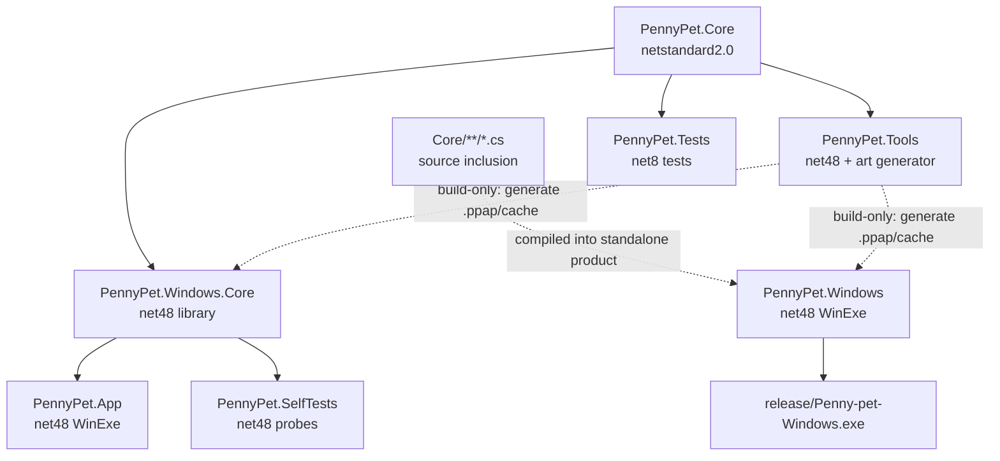

# Penny pet

Penny pet 是一款 Windows 桌面宠物，包含透明角色动画、普通便利贴、待办清单、日程、提醒、侧边页签、每日互动内容，以及可选的按键显示和本地天气。


## 下载 Penny pet

### [点击直接下载 Windows 版](https://github.com/692365092-png/penny-pet/releases/latest/download/Penny-pet-Windows.exe)

适用于 Windows 10 和 Windows 11。下载完成后双击运行即可，无需安装。

请只从本仓库的 Release 页面下载，以免拿到被他人修改的版本。

如需查看版本历史或下载校验文件，可前往 [Releases](https://github.com/692365092-png/penny-pet/releases)。

### 如果 Windows 阻止运行

Penny pet 目前没有购买商业代码签名证书，因此第一次运行时，Windows 可能显示
“Windows 已保护你的电脑”。这表示 Windows 暂时无法确认发布者身份，并不表示程序一定有问题。

确认文件来自上面的官方仓库后，可以点击 **更多信息**，再点击 **仍要运行**。
如果杀毒软件仍然阻止文件，或下载来源不是本仓库，请不要关闭安全软件强行运行。

Release 页面同时提供 `SHA256SUMS.txt` 校验文件，供需要核对文件完整性的用户使用；
普通用户不需要下载它。

## 使用说明

> 按键显示功能默认关闭。开启后只在本机显示按键名称，不保存或上传键盘内容；程序会尽力识别并隐藏密码框和敏感输入，但无法保证识别所有第三方或自绘输入框，处理高敏感信息时建议关闭此功能。

普通便利贴会把 `http://`、`https://`、`www.` 开头的网址，以及 Windows 本地文件/文件夹绝对路径显示为蓝色下划线；鼠标移上去会变成小手，单击即可用系统默认程序打开。待办清单和日程不会启用此识别。

右键菜单中的“将已展开的便利贴集中到此屏幕”会按当前显示器的 DPI 缩放，把普通便利贴、待办、日程和磁吸组合集中排列到小 Penny 所在屏幕。到点提醒气泡会保持显示，点击气泡才会关闭；后续功能提示或新提醒可以覆盖它。

“每日内容”中的本地天气默认关闭。开启前需要手动搜索并确认城市；Penny 不读取系统定位或使用 IP 猜位置。启用后只在每天第一次符合条件的戳击中按需取得预报，天气数据来源为 [Open-Meteo](https://open-meteo.com/)。网络不可用时会直接回退到其他每日内容，不影响桌宠和本地功能。

## 从源码构建

要求：Windows 10/11、Windows PowerShell 5.1、.NET 8 SDK，以及 .NET Framework 4.8 Developer Pack（仅安装 4.8 Runtime 不包含构建所需的引用程序集）。

### Canonical build graph

仓库的解决方案构建和公开发布使用同一组项目，依赖关系如下：



`PennyPet.Tools` 的程序集不是桌宠运行时依赖。它在构建阶段读取 `art/`，生成
`release-art.ppap` 和 `startup-art.cache`；`PennyPet.Windows` 与
`PennyPet.Windows.Core` 通过 `ReferenceOutputAssembly=false` 只借用这个构建顺序，
再由 `PennyPet.ArtResources.targets` 把生成文件嵌入各自的输出。

真正的公开单文件入口是 `PennyPet.Windows`，不是 `PennyPet.App`：`build.ps1`
构建前者并复制其 `Penny pet.exe`。`PennyPet.App` 是使用同一 Windows Core
实现的另一个 WinForms/WPF 宿主；它参与解决方案编译，但不产生公开下载文件。
`PennyPet.Tests` 只编译可测试的 Core/协议片段，不能代替 net48 Windows 编译。
特别要注意：`PennyPet.Windows.csproj` 是兼容单文件项目，它把 `Core/**/*.cs`
直接编进自己的程序集，不是对 `PennyPet.Core.dll` 或 `PennyPet.Windows.Core.dll`
的运行时引用；图中的 `CoreSources` 是源码纳入关系，不是 ProjectReference。

使用 Visual Studio 或标准 .NET 工具进行源码编译检查：

```powershell
dotnet build ".\PennyPet.sln" --configuration Release
```

解决方案会构建上图中的全部项目。生成用于公开分发的兼容单文件 EXE 仍使用：

```powershell
.\desktop-pet\build.ps1 -TargetPlatform anycpu -OutputFile ".\release\Penny pet-release.exe"
```

这一步会先构建 `PennyPet.Windows.csproj`，由 build-only 的 `PennyPet.Tools`
生成资源，再把 `art/pet-art.json` 引用的完整分辨率动画和启动缓存嵌入 EXE。
生成结果仍然是一个文件。

运行自动测试：

```powershell
dotnet test ".\desktop-pet\PennyPet.Tests.csproj" --configuration Release
.\desktop-pet\bin\Release\net48\PennyPet.SelfTests.exe --self-test="$env:TEMP\penny-selftest.json"
```

保护版构建会在未保护语义自测之后，使用固定哈希的 ConfuserEx 生成保护版，
并启动**实际保护后的 EXE** 做资源、窗口响应和正常退出检查：

```powershell
.\desktop-pet\build-protected.ps1 `
  -TargetPlatform anycpu `
  -OutputFile ".\release\Penny-pet-Protected.exe" `
  -SmokeReportPath "$env:TEMP\penny-protected-smoke.json"
```

这也是 Windows CI 的发布前门禁；它不表示 EXE 已购买商业代码签名证书。

正式 EXE 不包含自测命令入口。验证发布物时，在 Windows 测试环境运行外部冒烟脚本（会启动并正常关闭实际桌宠）：

```powershell
[xml]$props = Get-Content ".\desktop-pet\ProductVersion.props"
.\desktop-pet\test-release.ps1 `
  -Executable ".\release\Penny pet-release.exe" `
  -ExpectedVersion ($props.Project.PropertyGroup.PennyVersionPrefix + ".0") `
  -ReportPath "$env:TEMP\penny-release-smoke.json"
```

脚本检查版本和内嵌资源，再将单个 EXE 复制到临时目录，验证宠物窗口可响应及正常退出；领域和窗口交互自测仍由 `PennyPet.SelfTests` 执行。

## 源码结构

- `desktop-pet/`：Windows 桌宠、便利贴、待办、日程、提醒和自动测试。
- `PennyPet.sln`：Core、Windows Core、App、Tools、Tests、SelfTests 和兼容单 EXE 项目；依赖和发布顺序见上面的 canonical build graph。
- `art/`：构建单文件 EXE 所需的角色动画与界面美术；其许可边界见 `ASSET_LICENSE.md`。
- `ARCHITECTURE.md`：当前跨平台技术边界与 macOS 迁移地图。
- `DEVELOPER_GUIDE.md`：维护说明、数据位置、高风险兼容逻辑和平台边界。
- `.github/workflows/build.yml`：GitHub 自动构建与测试。

用户数据只保存在 `%LocalAppData%\PennyPet`，不会提交到仓库。

## 隐私

当前 Penny pet 不包含广告、账户系统或遥测，不会上传便利贴、提醒或键盘内容。可选天气只把用户手动选择城市的坐标和时区直接发送给 Open-Meteo；详情见 [PRIVACY.md](PRIVACY.md)。

天气数据由 [Open-Meteo.com](https://open-meteo.com/) 提供，采用 [CC BY 4.0](https://creativecommons.org/licenses/by/4.0/)；Penny 会把原始逐小时预报加工为简短生活提示。完整第三方声明见 [`THIRD_PARTY_NOTICES.md`](THIRD_PARTY_NOTICES.md)。

## 许可与美术资源版权

除另有说明外，Penny pet 的软件源代码依据 **GNU General Public License v3.0 or later（GPL-3.0-or-later）** 发布。

**Penny pet 中由画师 泥泥NINII 创作的角色与视觉美术资源不属于 GPL-3.0-or-later 的授权范围。** 软件代码采用 GPL 并不意味着这些美术资源已经获得 GPL 授权。未经权利人另行明确授权，不得使用这些美术资源，也不得将其用于任何商业用途。

详细说明见 [`ASSET_LICENSE.md`](ASSET_LICENSE.md)。软件代码许可证见 [`LICENSE`](LICENSE)。
