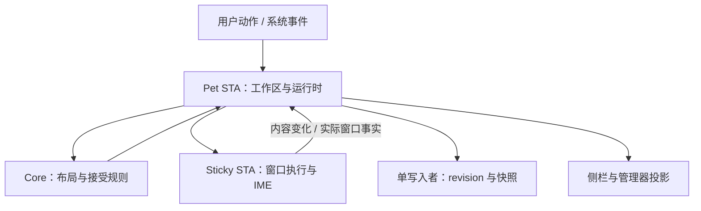

# Penny Pet 全面架构审查与第一批重构

审查日期：2026-09-09。提交基线：`d8b682c0c55552312d426e269337cfa1bab088bf`，目标分支：`codex/project-system-experiment`。

初审基线为 `0f5cd49`。恢复工作时远端新增 `a991ab2`、`6496795`、`d8b682c`，涉及 PC2B 比较工具、SelfTests 编译入口和测试分类文档；生产逻辑未变。本次以最新提交为父提交，保留这些工作。历史 PC2B golden、350 条分类及 306 个 SelfTest `_ok` 字段是冻结证据，不把它们改写成此次测试结果。

## 1. 判断与范围

真正需要重构的是状态归属和事件的数据量。简单的桌面应用承担了过多兼容字段同步、整份快照流转、分散的事务预检和重复列表构造。文件拆成很多 partial，并没有减少一个 PetForm 对象负责的事情。继续增加接口、协调器、版本字段或异常兜底，会放大这个问题。

最优先的问题是持久化预算不闭合，其次是几何与内容消息耦合、Dock 状态分散、主线程全量保存。侧栏排序、提醒拷贝、私有状态重建和默认同步跟踪日志，则是能够马上删除的成本。

但不能把所有防御都删掉。文件导入是外部输入，两个 STA 之间存在真实时序差异，HWND 重建会重置序列，中文输入法存在组合态，操作系统可能拒绝或修正窗口位置。这些是需求本身的复杂度。本次删除的是能够证明冗余的工作，保留实际边界约束。

本报告包含全仓逐层审查、15 项具体问题、可执行的目标架构与分阶段迁移条件；代码实现了其中一批边界清晰的优化。它不是“整个系统已经重写完成”或“性能已经达到最高”的证明。Linux 上的算法测量不能代表 Windows 的帧率、输入延迟或混合 DPI 表现。

## 2. 从用户行为到代码的覆盖

| 用户需要 | 已审查的实现路径 | 结论与下一步 |
| --- | --- | --- |
| 启动及时出现桌宠、动画平滑 | 启动加载窗、PetArt、PetAnimationRuntime、LayeredSpriteRenderer | 加载窗独立 STA 有响应性价值；解码锁、整段缩放、逐帧 GDI 分配值得重做 |
| 自然输入文字、富文本、中文 IME | StickyNoteWpf、StickyEditorCoordinator、StickyWindowSession | 组合输入期间不能任意重载文档；优化事件边界，而非直接替换编辑器 |
| Todo、日程、关联提醒 | Core 模型、内容快照、ReminderSchedule、StickyUiCommand | 保留业务语义和条目顺序；提醒重复深拷贝已去除 |
| 多屏移动、缩放、拔插后恢复 | Display Core、Windows adapter、placement runtime、session | 实际 HWND WindowFacts 是几何事实；偏好位置与临时位置必须区分 |
| Dock 拖动、组合、分隔线调整 | 两个 PetSticky partial、DockInteractionSession、计划邮箱 | 成员关系和手势生命周期需要单一所有者；整批预检不能删除 |
| 隐藏、侧栏、置顶、不抢焦点 | StickyNoteTabs、tab layout、Z-order、native hooks | 遮挡查询已变成无排序扫描；保留 native 激活与层级策略 |
| 自动保存、退出、恢复损坏文件 | Repository、AtomicTextFile、快照/代际门禁 | 读写预算不闭合，保存路径重复规范化；优先修正数据可靠性 |
| 导入、导出、合并 | `.pennysticky` codec、import planner、persistence coordinator | NoteId 是身份；默认合并、冲突保留，不按文本或 AI 去重 |
| 管理大量便利贴 | Manager 列表、过滤、搜索字段 | 输入变化时同步重建结果，长内容和 I/O 比 100 个条目数量更值得关注 |
| 每日内容、天气、静默与偏好 | DailyContent、Weather source、PetForm 回调 | 请求后没有重核当前偏好；委托构造与伪异步注册可以简化 |
| 可维护、可验证、可发行 | Core/Windows 项目、MSTest、结构测试、双 SelfTest、CI | 保留真实行为和平台门禁；逐步删除绑定源码写法的测试 |

基线约 209 个 C# 文件、57,197 行：Core 76 个文件/8,610 行，Windows 与宿主/工具 92 个文件/30,215 行，测试 39 个文件/9,273 行，两个旧 SelfTest 文件共 9,099 行。两个 PetSticky partial 合计 5,106 行；StickyNoteWpf 2,364 行，StickyWindowSession 1,218 行。行数只是定位责任集中的线索，不是质量评分。

冻结分类中的 350 个测试用例分为：135 个 SOURCE_STRING_GUARD（38.6%）、148 个 PURE_BEHAVIOR、46 个 MIGRATION、21 个 PROTOCOL_BEHAVIOR。其中仅 118 个带 `ArchitectureSourceBoundary` 标签，因此过滤该标签不等于移除了全部源码字符串测试。最新 platform_scope 分类进一步明确：测试可能在验证 Windows 契约，但这 350 个用例都不实际触碰 native Windows。

## 3. 具体问题、影响与处理

### F01 · P1 · 保存器可写出读取器拒绝的数据集

证据：[大小限制][limits]、[读取器][repo_read]、[写入器][repo_write]。单条允许 400 万正文字符和 1,600 万 RTF 字符，最多 100 条；整个数据文件读取限制却只有 32 MiB。`WriteSnapshot` 序列化后没有相同的总字节预算检查，导出也没有形成一致的数据集预算。

可复现样本：两条各 100 万正文字符、1,500 万 RTF 字符的 note，每条都在字段上限之内。实际 `StickyNoteCodec.SerializeLine` 的 UTF-8 字节数加 Windows CRLF，两条总计约 4,267 万字节，超过 33,554,432 字节读取上限。精确数值见 `verification.json` 的 codecBudget。这里实际运行了 codec，不是 Windows 文件写入后重启的集成复现。

推论：保存可以报告成功，下次加载主文件却因过大失败，可能回退到较旧备份，或无法正常恢复最新内容。这比冗余 null 检查更值得优先修正。

目标：编辑准入、导入预检、序列化、读取共享同一套可表示数据集的预算；用流式读取和写入控制峰值内存，并针对持久化的实际编码计算字节数。产品若保留当前巨大单条上限，应相应支持文件分片/分条持久化或重新定义总预算。不能只在保存末尾补一个 throw，把已经显示在编辑器中的文字留在无法保存的状态。本批未更改文件格式或编辑容量契约。

### F02 · P1 · 三套持久化坐标长期参与运行时推理

证据：[模型][geometry_model]、[Dock 规划][dock_plan]、[Session 放置][session_placement]。物理 X/Y/Width/Height、v10 DisplayId + LocalLogical、v11 PreferredDisplayTargetKey + PreferredLocalLogical 同时存在；运行时又有实际 WindowFacts 和计划值。Dock 仍读取 LocalLogicalHeight，Session 仍承担偏好与旧坐标回退决策。

目标运行时只保留两种明确含义：用户希望的位置（稳定显示器身份、逻辑坐标），系统实际观察到的位置（HWND 物理事实）。临时回迁意图独立于两者。v10 字段成为读取/迁移和必要兼容输出的适配字段，不再作为实时布局输入；放置策略归 Core/Pet 侧，Session 只执行计划并回报事实。

删除条件：所有 live consumers 已迁移，并通过旧文件读取、不同 DPI 重启、显示器消失/返回、用户临时移动等验证。现在直接删字段或 fallback 会破坏已有行为。本批未进行该迁移。

### F03 · P1 · 几何事件运输完整内容快照

证据：[EmitSnapshot][session_snapshot]、[内容应用][snapshot_apply]。Bounds/HeaderDrag 路径构造完整快照，复制 Todo/Schedule 集合，同时捕获几何；Pet 侧应用内容时又重建条目。字符串本身是不可变引用，不应夸大为“每次拖动都深复制整份 RTF 字符串”；明确的浪费是快照构造、集合与条目重建、无关字段传输和过度通知。

目标分为 `ContentChanged(contentRevision, snapshot)` 与 `GeometryObserved(sessionId, sequence, facts, gesture)`。移动只传位置事实。内容变化时捕获一次不可变内容值，最终 flush 必须与 IME 安全提交时点对齐。普通事件中“内容有效但几何已过期”是合法情况，不能为了统一验证而把有效内容一并丢弃。

本批未改消息协议。后续这是第一条值得做的完整纵向重构。

### F04 · P1 · 状态接受权分散，调用者重复维护事务规则

证据：[整批提交][commit]、[邮箱和 batch][mailbox]、[effective runtime][effective]。Pet partial、HostedRuntime、PlacementRuntime、Dock session、mailbox 分别掌握成员关系、内容/事实水位、交互 epoch、最终提交状态，调用点需要知道过多组合条件。

本批删除 `WindowFactsVersionRules.Classify` 已保证的同一组 NoteId、generation、sequence 重复判断，保留目标 surface/DPI、当前 hosted lease 以及 effective 接受检查。不同时间、不同边界的校验不能据此合并。

目标把接受规则交给唯一的 runtime owner。整批几何先对所有成员做纯预检，拒绝时 canonical、effective、lease、membership、保存状态全部零写入；所有候选通过后，在 Pet STA 一次同步提交。提交段内不 await、不调用 native、不触发可重入 callback。窗口操作在提交前后各自的明确阶段执行。`CanAcceptEffective` 必须始终保持只读。

### F05 · P1 · 保存路径重复复制、规范化，IO 异步不等于 UI 轻量

证据：[同步保存][repo_save]、[异步保存][repo_async]、[写入器][repo_write]。同步保存会规范化 live notes、克隆，写入时再次规范化；异步保存也先在 Pet 线程复制全量数据。同步/异步/导入/退出通过多套 generation 和 gate 防止旧快照覆盖新数据。当前防倒退机制有必要，但责任可以更集中。

目标：工作区命令维护有效成员关系；持久化层只序列化有效快照。单一 writer 只保留一个正在写的 revision 和一个最新待写 revision，完成时报告确切 revision；退出显式 flush 到目标 revision。导入是预览加工作区版本校验的提交，不能绕过写入所有权。

迁移过程先关闭直接修改公共字段的入口，再移除保存时规范化。否则“简化”会使原本靠保存修复的数据关系损坏。本批未删除 IO gate、备份、原子替换或恢复机制。

### F06 · P2 · DockParent 与 GroupId/Order 是两种成员关系表达

证据：[数据模型][geometry_model]、[分组规范化][normalization]。隐藏成员保留位置、可见成员重新连链，导致父链和分组顺序反复互相修复。

目标：一个 DockGroup 保存有序 NoteId 列表（包含隐藏成员）、组宽度和置顶偏好；单个 note 保存自身高度。可见父链由列表投影得到，不独立持久化。组逻辑不按普通文字/Todo/日程分叉。最多 100 张便利贴，清晰的 O(n) 操作比空间树、通用图框架更合适。

本批未改变 Dock 存档关系。

### F07 · P2 · 侧栏存在性查询复制并排序全部便利贴（已改）

证据：[侧栏遮挡][strip]、[GetAll][getall]。每一侧只问“是否存在可见窗口相交”，却构造按修改时间排序的列表，左右两侧重复执行，移动窗口时反复触发。

改为仓库内同一个只读 live view 和无排序的物理矩形扫描；保留严格相交、隐藏项、无效尺寸和边缘刚好接触的原有语义。查询复杂度从含排序的 O(n log n) 降为 O(n)，每次扫描不再分配列表。没有引入缓存、脏标记或额外失效状态。该 view 只供 Pet 线程即时读取，不跨线程、不跨修改保存。

菜单/导出计数也改用现有 Count。需要按时间排序的 Manager 仍使用 GetAll。侧栏刷新中可能重复的布局/native Z-order 操作，本批未盲删，因为早退和重入路径需要 Windows 验证。

### F08 · P2 · 私有单线程状态被当作不可变消息反复重建（已改）

证据：[placement runtime][effective]。每接受一次 WindowFacts、标记用户移动或切换临时回迁，都会新建 NotePlacementState。这个私有对象从未逃逸到其他线程。

改为原位更新私有状态，已发布的 WindowFacts 仍不可变；预检不写入，拒绝不改变任意字段，session 失效仅清除 effective 水位而保留临时意图。补充测试直接检查此前返回事实、临时意图、用户移动、拒绝和重新接受的行为。

### F09 · P2 · 提醒命令重复复制数组和不可变元素（已改）

证据：[CopyReminders][remindcopy]。工厂先复制，构造函数再次复制；每次重新 new ReminderItem 并重复规范化。ReminderItem 的内容字段均为 private set，构造后不可变。

改为构造函数统一接收 enumerable、仅分离一次集合所有权，共享不可变条目。继续过滤 null、保序、最多五条。测试修改输入集合和其中一个命令的数组，确认其他命令独立；不把“必须 new 一个相同对象”作为契约。

### F10 · P2 · 默认详细跟踪把同步文件 IO 放进交互路径（已改）

证据：[窗口日志][trace]、[开关][traceswitch]。原来除非环境变量为 0，否则默认跟踪；窗口层写入获取全局锁，检查目录和日志大小，再 AppendAllText。原实现已有 1 MiB 轮换，不是无上限增长问题。

详细 display/window-layer trace 改为 `PENNY_DISPLAY_TRACE=1` 显式启用，异常日志保持原行为。在两处高频 WindowFacts 日志入口先检查开关，避免关闭时仍格式化大量字段。开启追踪后仍为同步写入；本批没有宣称所有诊断字符串成本已经消失。若需要常开性能观测，应做有界聚合和批量输出，不记录每个窗口事件。

### F11 · P2 · 动画每帧创建与销毁 GDI 资源

证据：[renderer Show][render]。每帧 GetDC、CreateCompatibleDC、GetHbitmap、SelectObject、UpdateLayeredWindow，再回收 handles。GPU 不是第一步必选项；首先去掉资源生命期错误粒度。

目标：render surface 拥有可复用内存 DC 与 DIB，尺寸改变时才重建，帧更新只搬运必要像素并提交。退出和尺寸切换有唯一 Dispose 所有者。记录 handle 数、逐帧耗时和进程内存，不能把纯 Core 微基准当成这部分已经改善。本批未修改 native renderer。

### F12 · P2 · 资源锁覆盖解码，UI 按整段 clip 做缩放

证据：[GetClip][artlock]、[EnsureRenderedRow][resizeframes]、[preload][preload]。共享锁涵盖资源解码，主线程状态读取可能等同一锁；UI 按整段 clip 生成缩放帧，预加载通过循环等待已有加载。

目标：每个资源键一个共享加载 Task；注册字典时短锁，解码和必要尺寸准备在后台；只允许当前 render generation 发布。缓存按实际内存有界，退出、淘汰与正在使用的 Bitmap 生命周期明确。优先保证首帧，再准备后续动作。不是把所有图都无限预解码，也不是再包装一套通用 provider 框架。本批未改 Bitmap 跨线程和 native 所有权。

### F13 · P2 · 源码字符串测试冻结实现写法（部分改）

证据：[Drt7 原测试][testguard]。它要求源码含 `userMoved = state.IsTemporaryRehome`，改成本来就等价的字段赋值也会失败。此类测试让冗余逻辑变成“不能动的契约”。

本批将 Drt7 移到 StickyPlacementRuntimeTests，直接执行临时回迁→用户移动→再次临时回迁→返回的行为。测试总数没有因迁移减少；测试 ID 的类名变化是有意的。Dock generation 测试改为验证统一 classifier 的接线，实际判断由已有 WindowFactsVersionRulesTests 覆盖。

保留 Core 不依赖 Windows、native 调用边界等有意义的结构约束；不要机械删除所有 source guard。后续按用户可见行为建立少量完整协议测试、文件迁移 fixture 与 Windows 集成场景，再移除仅绑定私有方法名/局部变量/调用字符串的测试。冻结历史 CSV 不改；本次差异单列。

### F14 · P2 · 管理、导入和文件探测可能阻塞交互线程

证据：[管理器过滤][search]、[导入][import]、[链接处理][link]。TextChanged 同步构建搜索文字和列表项；导入在 UI 路径读文件、预检、规划并等待提交。100 张便签并不意味着数千万字符和网络路径 IO 很小。

目标：搜索使用与 content revision 对应的派生索引，结果只更新有差异的行；耗时导入先后台读取/验证，展示计划，再核对工作区 revision 提交。UNC 风险提示必须在触碰远端路径之前；提示后 File.Exists/Directory.Exists 仍可能阻塞 Sticky STA，应采用有界异步操作并提供明确的进行中/失败反馈。

不需要完整搜索引擎、全应用状态管理框架，或为每个按钮增加确认框。本批未改变 UI 交互。

### F15 · P2 · DailyContent 委托过多，异步完成仍采用旧偏好

证据：[DailyContent][daily]、[weather 注册][weather]。构造函数接收 13 个委托，再把其中十项包成 preferences snapshot；一个明确的 `Func<DailyContentPreferencesSnapshot>` 即可表达同样需求。

更实际的行为缺口：天气请求前读取偏好，await 返回后直接展示内容。PetForm 的展示回调检查退出/销毁等条件，但不会完整重核 DailyEnabled、城市等请求相关偏好；用户等待期间关闭功能或切换城市，存在显示旧配置内容的代码路径。这是静态发现，不是已做 GUI 复现。

目标：请求记录必要偏好 revision，展示前重新判断当前开关/静默/城市及请求有效性；只在成功显示后记录日期。Weather source 用显式 shared-task 注册取代为登记 in-flight 而 `Task.Delay(1)`。保留超时、有限缓存和 opt-in；不新增通用天气框架。本批未更改 DailyContent。

## 4. 目标架构：状态有明确主人，消息只带本次变化

下面是迁移目标，不是此次新增的一套空类或接口。

| 所有者 | 唯一负责的状态 | 输入/输出与边界 |
| --- | --- | --- |
| NoteWorkspace（Pet STA） | notes、稳定 NoteId、Dock 有序成员、内容 revision | 接受业务命令，命令结束即满足成员关系不变量；生成一致持久化视图 |
| NoteRuntime（Pet STA） | 当前可选 session、已接受内容/事实水位、临时回迁意图 | 唯一消息接受入口；session 消失只使对应事实水位失效 |
| DockGesture（Pet STA） | phase、interaction epoch、成员基线、待提交计划 | 规划是纯计算；同一手势只有一个状态机和最终提交点 |
| StickyUiHost / Session（Sticky STA） | WPF/WinForms 窗口、IME、HWND 和 native 资源 | 执行有序命令，捕获真实 WindowFacts；不修复业务成员、不决定持久化偏好 |
| PersistenceWriter | 正在写的 revision、最新待写 revision、写入结果 | 单 writer；磁盘故障显式反馈，退出 flush 到指定 revision |
| SideTab presentation | 某工作区 revision 的显示投影、布局与遮挡结果 | 按变化刷新；投影不反向成为便签关系的真相 |
| Art loader / render surface | 资源键加载任务、尺寸 generation、DC/DIB 生命周期 | 短锁注册、后台准备、当前代发布、按内存预算淘汰 |

一个全局 sequence 不能替代所有版本：

| 标识 | 表达什么 | 失效边界 |
| --- | --- | --- |
| NoteId | 业务身份，导入合并依据 | 删除该便签 |
| SessionId + local sequence | 本次 HWND 生命周期内的事件顺序 | 关闭或重建该 session |
| ContentRevision | 内容更新顺序 | 接受较新内容；不因几何过期而自动丢弃 |
| TopologyGeneration | 本次显示器拓扑 | 显示器身份/工作区/DPI 改变 |
| InteractionEpoch | 本次手势 | 新手势、取消或重基线 |
| PlanSequence | 同一交互内的计划顺序 | 较新 live 计划或最终提交 |

消息只带相关版本，不让所有消息承担一整套全局状态。只有可丢弃的 live preview 可以“仅保留最新”；最终提交、删除、flush、导入与退出必须有可靠顺序和完成确认。容错应在故障能发生的边界闭合，不由每个调用者重新组合十个条件。

## 5. 应删除、保留与暂缓的设计

| 设计 | 决策 | 原因或条件 |
| --- | --- | --- |
| 私有状态的伪不可变重建 | 已删 | 未跨线程、未对外发布，原位更新更直接 |
| 不可变提醒的重复深拷贝 | 已删 | 保留数组隔离即可 |
| 存在性查询的全量排序 | 已删 | 顺序与答案无关，无需缓存 |
| classifier 后的同值重复验证 | 已删 | 单点规则已有真实行为测试 |
| 默认逐事件窗口文件日志 | 改为按需 | 错误诊断继续保留 |
| 变量名/语句写法测试 | 逐项迁移 | 本批 Drt7 已换行为测试 |
| live v10 坐标、持久化父链 | 待纵向迁移后删 | 还有真实消费者和旧文件兼容需求 |
| 保存时多轮 NormalizeAll | 收口写入口后删 | 现在公共字段仍可制造不一致状态 |
| 13 个偏好委托、Task.Delay 注册 | 适合后续直接简化 | 不需要新 DI/container/provider 层 |
| 原子保存、备份、未来版本保护 | 保留 | 真实数据可靠性边界 |
| 跨 STA 快照、HWND 生命周期版本 | 保留并缩小数据量 | 防止共享可变对象和旧窗口事件污染新状态 |
| 整批预检、拒绝零写入 | 保留 | 防止部分更新造成 Dock 分裂 |
| native no-activate / IME 特殊处理 | 保留至 Windows 证据充分 | 不能只靠 Core 测试推断交互等价 |
| 启动加载窗的独立 STA | 保留 | 实际启动响应性需要，不是抽象数量问题 |

`.pennysticky` v1 当前承诺导出 Sticky 数据集，提醒记录仍在 settings.ini；导入清除便签 reminder ticks 是现有语义，不应将它描述为本次发现的提醒回归。如要提供“整套工作区备份”，应另立版本化产品需求。本次保留 NoteId 合并与冲突副本，不做文本去重。历史 v10 导入验证问题在当前代码已修复，不能复用旧审查结论指认它仍存在。

## 6. 本批实现与性能证据

实现范围：F07、F08、F09、F10；F04 的重复判断删除；F13 的一条行为测试迁移及 classifier 接线调整。没有替换 UI 框架、改变存档 schema 或添加服务容器。

基准源码位于 `benchmark/`，直接链接生产中的 placement runtime 和 reminder command；侧栏基线复制原 GetAll + Rectangle.IntersectsWith 算法，改后调用实际新规则。每项先预热 3 次，采样 7 次，记录中位数和全部原始样本。分别覆盖 10/50/100 张便利贴，每轮 20,000 次遮挡查询，以及 10,000 次事实接受、10,000 次五条提醒命令构造。数据准备在计时区间外。

| 场景 | 基线中位数 | 改后中位数 | 基线分配 | 改后分配 |
| --- | ---: | ---: | ---: | ---: |
| 接受 10,000 次窗口事实 | 0.3917 ms | 0.1874 ms | 400,280 B | 320 B |
| 构造 10,000 次五条提醒命令 | 7.4261 ms | 4.3454 ms | 23,280,040 B | 3,760,040 B |
| 10 张便签 / 20,000 次遮挡查询 | 5.4933 ms | 1.1290 ms | 2,720,040 B | 40 B |
| 50 张便签 / 20,000 次遮挡查询 | 19.4983 ms | 5.5063 ms | 9,120,040 B | 40 B |
| 100 张便签 / 20,000 次遮挡查询 | 48.4507 ms | 11.2508 ms | 17,120,040 B | 40 B |

精确结果、运行时信息和数据集预算样本见 `verification.json`。分配量和耗时应一起读：扫描不再每次分配列表，测量器自身仍会分配少量字节。没有测量日志关闭的毫秒收益，没有用 Core 时间推算 Windows FPS，也没有宣称 native 渲染已优化。

## 7. 验证与边界

此次新增 12 个数据用例（侧栏与提醒 10 个、runtime 2 个），并把已有 Drt7 从源码测试迁移为执行行为。实际辅助执行：基线 350/350 通过，改后 362/362 通过；带 ArchitectureSourceBoundary 标签的通过用例从 118 变为 117。产品 C# 源码的 net48 引用程序集编译零警告、零错误。原始结果见 `verification.json` 及 `evidence/`。

标准测试入口是 `dotnet test`，不修改仓库测试框架配置。当前 Linux 环境中，基线和改后 VSTest 17.11.1 都在 TestEngine.ShouldRunInProcess 抛出 NullReferenceException，尚未执行测试。已单独记录该失败，并使用临时反射入口直接执行同一编译产物中的 MSTest 方法和 DataRow，使用真实 Assert。仓库当前没有 test initialize/cleanup、dynamic data 或 expected-exception 生命周期需求。该辅助执行不等价于标准 VSTest 宿主通过，更不代表 Windows 集成测试通过。

另以 .NET Framework 4.8 官方 reference assemblies 编译全部非 MSTest 的产品 C# 源码，包括 WinForms、WPF 和 SelfTest 源文件。它只证明 C# 类型与调用关系可编译，不执行资源生成、正式解决方案打包和 native 窗口。

Windows 合并前仍需完成：

1. `dotnet build PennyPet.sln -c Release` 与标准 `dotnet test desktop-pet/PennyPet.Tests.csproj -c Release --no-build`。
2. modular SelfTests 与单文件 EXE SelfTests，使用原有 PC2B 比较脚本核对 306 个冻结字段及双产物一致性。
3. 中文 IME 输入/换焦点/退出保存；多屏不同 DPI 拖动、缩放、拔插与重启回迁；Dock 中隐藏、删除、取消及中途拓扑变化；侧栏遮挡、置顶、不激活。
4. `PENNY_DISPLAY_TRACE` 未设置/0/1 的开关行为，以及关闭详细跟踪时异常日志仍写入。

现有 GitHub 工作流自动触发的目标是 main（另有 tag 和 workflow_dispatch）。本 PR 目标是实验分支，不能把“PR 没有红灯”当成 Windows CI 已通过。未改 CI 触发范围。

## 8. 下一步按完整行为迁移

**第一批纵向迁移：内容与几何分流。** 从拖动一张便签开始，收口 NoteRuntime 接受入口与 session 身份，纯几何事件不构建内容条目；再覆盖 Dock 的 live、final、取消、重基线，最后移除 live v10 坐标消费者。退出/flush/IME 与拒绝零写入是验收条件。完成这批后再删除旧事件字段和分散状态，而不是先铺几十个新接口。

**第二批：可保存工作区与单写入者。** 先定义可表示的数据集预算与错误反馈，打通编辑→保存→重启和导入→导出闭环；以显式 Dock 有序成员替代双关系；关闭任意公共字段写入后去掉重复规范化，最后合并同步/异步保存入口。验收使用最大合法数据、磁盘失败、退出和旧快照竞争，而不是只测正常小文件。

**第三批：渲染和 UI 投影。** 先测 native 帧耗时/handles/内存，再实现可复用 DC/DIB 和按需尺寸资源任务；侧栏和 Manager 按 revision 更新，导入和网络路径探测异步化；每日内容展示前重新核对请求相关偏好。以首帧时间、输入延迟和 P95/P99 交互时间决定后续优化，不以抽象数量决定架构。

这三批可以各自形成可回滚、可测试的完整改动。当前交付已经删除有实测依据的冗余，也把不能仅凭 Linux 单元测试证明等价的重构边界具体写清楚。

[limits]: https://github.com/692365092-png/penny-pet/blob/d8b682c0c55552312d426e269337cfa1bab088bf/desktop-pet/Core/StickyNotes/StickyNoteModels.cs#L11
[repo_read]: https://github.com/692365092-png/penny-pet/blob/d8b682c0c55552312d426e269337cfa1bab088bf/desktop-pet/Features/StickyNotes/StickyNoteRepository.cs#L192
[repo_write]: https://github.com/692365092-png/penny-pet/blob/d8b682c0c55552312d426e269337cfa1bab088bf/desktop-pet/Features/StickyNotes/StickyNoteRepository.cs#L900
[repo_save]: https://github.com/692365092-png/penny-pet/blob/d8b682c0c55552312d426e269337cfa1bab088bf/desktop-pet/Features/StickyNotes/StickyNoteRepository.cs#L629
[repo_async]: https://github.com/692365092-png/penny-pet/blob/d8b682c0c55552312d426e269337cfa1bab088bf/desktop-pet/Features/StickyNotes/StickyNoteRepository.cs#L525
[geometry_model]: https://github.com/692365092-png/penny-pet/blob/d8b682c0c55552312d426e269337cfa1bab088bf/desktop-pet/Core/StickyNotes/StickyNoteModels.cs#L160
[normalization]: https://github.com/692365092-png/penny-pet/blob/d8b682c0c55552312d426e269337cfa1bab088bf/desktop-pet/Core/StickyNotes/StickyNoteModels.cs#L303
[dock_plan]: https://github.com/692365092-png/penny-pet/blob/d8b682c0c55552312d426e269337cfa1bab088bf/desktop-pet/Features/StickyNotes/PetStickyDockCoordinator.cs#L496
[session_placement]: https://github.com/692365092-png/penny-pet/blob/d8b682c0c55552312d426e269337cfa1bab088bf/desktop-pet/StickyWindowSession.cs#L178
[session_snapshot]: https://github.com/692365092-png/penny-pet/blob/d8b682c0c55552312d426e269337cfa1bab088bf/desktop-pet/StickyWindowSession.cs#L1045
[snapshot_apply]: https://github.com/692365092-png/penny-pet/blob/d8b682c0c55552312d426e269337cfa1bab088bf/desktop-pet/Features/StickyNotes/StickyUiCommand.cs#L452
[strip]: https://github.com/692365092-png/penny-pet/blob/d8b682c0c55552312d426e269337cfa1bab088bf/desktop-pet/Features/StickyNotes/PetStickyWindowCoordinator.cs#L3095
[getall]: https://github.com/692365092-png/penny-pet/blob/d8b682c0c55552312d426e269337cfa1bab088bf/desktop-pet/Features/StickyNotes/StickyNoteRepository.cs#L459
[effective]: https://github.com/692365092-png/penny-pet/blob/d8b682c0c55552312d426e269337cfa1bab088bf/desktop-pet/Features/StickyNotes/StickyPlacementRuntime.cs#L56
[remindcopy]: https://github.com/692365092-png/penny-pet/blob/d8b682c0c55552312d426e269337cfa1bab088bf/desktop-pet/Features/StickyNotes/StickyUiCommand.cs#L277
[trace]: https://github.com/692365092-png/penny-pet/blob/d8b682c0c55552312d426e269337cfa1bab088bf/desktop-pet/ApplicationDiagnostics.cs#L66
[traceswitch]: https://github.com/692365092-png/penny-pet/blob/d8b682c0c55552312d426e269337cfa1bab088bf/desktop-pet/Infrastructure/Display/DisplayDiagnostics.cs#L20
[commit]: https://github.com/692365092-png/penny-pet/blob/d8b682c0c55552312d426e269337cfa1bab088bf/desktop-pet/Features/StickyNotes/PetStickyWindowCoordinator.cs#L1635
[mailbox]: https://github.com/692365092-png/penny-pet/blob/d8b682c0c55552312d426e269337cfa1bab088bf/desktop-pet/Features/StickyNotes/DockWindowFacts.cs#L94
[render]: https://github.com/692365092-png/penny-pet/blob/d8b682c0c55552312d426e269337cfa1bab088bf/desktop-pet/LayeredSpriteRenderer.cs#L42
[artlock]: https://github.com/692365092-png/penny-pet/blob/d8b682c0c55552312d426e269337cfa1bab088bf/desktop-pet/PetArt.cs#L1338
[resizeframes]: https://github.com/692365092-png/penny-pet/blob/d8b682c0c55552312d426e269337cfa1bab088bf/desktop-pet/PetAnimationRuntime.cs#L517
[preload]: https://github.com/692365092-png/penny-pet/blob/d8b682c0c55552312d426e269337cfa1bab088bf/desktop-pet/PetAnimationRuntime.cs#L389
[search]: https://github.com/692365092-png/penny-pet/blob/d8b682c0c55552312d426e269337cfa1bab088bf/desktop-pet/Features/StickyNotes/StickyNotes.cs#L631
[import]: https://github.com/692365092-png/penny-pet/blob/d8b682c0c55552312d426e269337cfa1bab088bf/desktop-pet/Features/StickyNotes/PetPersistenceCoordinator.cs#L137
[daily]: https://github.com/692365092-png/penny-pet/blob/d8b682c0c55552312d426e269337cfa1bab088bf/desktop-pet/PetDailyContentCoordinator.cs#L68
[weather]: https://github.com/692365092-png/penny-pet/blob/d8b682c0c55552312d426e269337cfa1bab088bf/desktop-pet/Infrastructure/Weather/PetWeatherSource.cs#L140
[link]: https://github.com/692365092-png/penny-pet/blob/d8b682c0c55552312d426e269337cfa1bab088bf/desktop-pet/Features/StickyNotes/StickyLinkService.cs#L83
[testguard]: https://github.com/692365092-png/penny-pet/blob/d8b682c0c55552312d426e269337cfa1bab088bf/desktop-pet/Tests/StructuralGuards/DisplaySourceGuardTests.cs#L208
