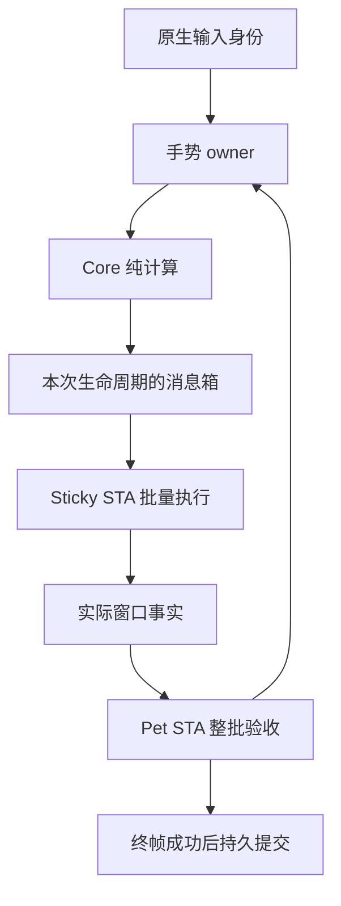

# Geometry authority：分层审查与 Dock 流水线重构

审查基线：`codex/geometry-authority`，`b0efb1375e3ab545197ec709c1057cd8fe4c2836`。日期：2026-09-22。

本轮从产品行为、线程与状态所有权、几何计算、存储、渲染、测试及构建逐层审查；实际重构集中在 Dock 拖动、缩放和拓扑恢复的共享路径。这里区分已修复问题、值得继续重构的问题和必须保留的约束。没有把整个桌面程序描述成已经重写或已经通过真实多屏验收。

## 1. 判断

目前最有价值的改进是让状态只活在它所属的生命周期内，并删除边界之间的重复工作。继续增加“防止旧回调”的标志位、额外协调器或缓存，只会扩大需要证明的状态空间。

现有代码的复杂性有两种来源：一部分来自真实的 Windows 约束，如两个 STA、原生拖动、IME、不同 DPI、显示器热插拔和用户数据恢复；另一部分来自重复消息箱、泄露给调用者的锁与字段、为了复用上层入口而构造假事实、没有使用者的旧几何算法，以及测试对源码拼写的绑定。本轮删除后一部分，并保留前一部分的明确边界。

不能在没有目标硬件和 Windows 端到端测量的情况下宣称“性能最高”。本次有确定性的竞态复现、行为回归和可重跑的微基准，性能结论限定在实际测量的路径内。

## 2. 已修复的设计问题

| 优先级 | 位置与问题 | 可观察后果 | 本轮修改 |
| --- | --- | --- | --- |
| P1 | `DockGestureOwner.Plans` 复用同一个 `DockPlanMailbox`，`Clear()` 会重新开放对象 | 已排队的旧 STA 回调可能取走下一手势或下一拓扑的计划；原生窗口可以执行新计划，而完成回调仍携带旧 epoch，结果被 Pet 拒收 | 每次 reset / topology invalidate 都取消旧实例并创建新实例；取消后永久关闭；回调捕获具体实例 |
| P2 | 拖动和缩放拥有两个相近但不一致的 mailbox；拖动调用方直接写 `Current` / `ApplyQueued` 并锁 `Gate` | 锁协议散落于 owner、controller、host 和自测，维护者需要同时理解多个状态组合 | 合并为 `DockFrameMailbox<T>`；私有锁和 `Live / Final / Cancelled` 状态；统一 live、final、correction、cancel 协议 |
| P2 | 终帧用 `FinalPlanSequence` 作为运输层令牌；完成时动态读取 `Gestures.Plans` | 回调没有显式持有所完成的运输生命周期 | `TakeFinal` / `CompleteFinal` 使用实际计划对象身份；闭包持有 `finalMailbox`；`PlanSequence` 留在手势 owner，用于真实结果排序 |
| P2 | `CaptureDockFacts(notes)` 先转 ID，再逐个调用线性 `Find`；调用者还先复制、按修改时间排序 | 100 张便笺时会在拖动中反复做 O(n²) 查找及不必要分配 | 直接遍历已有 note 引用，从 `StickyPlacementRuntime` 取事实；无需排序的调用使用已有只读 `InStorageOrder` |
| P2 | 组查询、merge resolve/commit 要求 `IList`，使调用端习惯先 `GetAll()` | 对最终会按 Dock 顺序排序的结果，先做一次无关的全局时间排序 | 只枚举的接口改为 `IEnumerable`；组自身的排序和产品顺序保留 |
| P2 | `PlanReproject` 构造假 `WindowFacts` 调用拖动入口，然后再复制一份去掉 source；居中还会复制 group | 恢复意图被伪装成实际 HWND 事实，多次复制同一几何数据 | 提取纯 `ProjectGroup`；拖动和恢复各自在入口校验真实输入，再直接生成最终计划 |
| P3 | `StickyUiThreadHost.PostDockPlan` / `PostResizeBatch` 只包装同一个 dispatcher 操作 | 线程宿主认识业务 payload，重复的入口没有增加能力 | 复用已有 `PostToDispatcher`，payload 选择由 `StickyUiHost` 的类型化闭包完成 |
| P3 | `CalculateDockTranslationTargets` 已无生产调用，但仍被自测调用和源码断言要求存在 | 测试把过时算法锁死，删除死代码反而报错 | 删除算法；自测调用真正的 `DockPlacementPlanner` |
| P3 | 对 internal 属性使用默认 `GetProperties()` 做“不可变”自测 | 默认只枚举 public 属性，这些断言可以在零枚举时始终通过 | 删除空洞反射检查；计划和批结果改测输入集合清空后仍独立；标准测试验证只读集合拒绝修改 |
| P3 | 架构文档仍提到已经不存在的 coordinator 和 v1-v9；PR 构建只覆盖 main | 维护者沿错误地图改代码，指定分支的 PR 无法自动验证 Windows | 更新当前 ownership / v1-v11 文档；现有 Windows workflow 的 PR 目标增加 geometry-authority |

`ResetDrag(bool clearMailbox)` 的所有生产调用都传 true。本轮直接删除这个从未使用的选择，而非为 false 分支继续维护另一种生命周期。

## 3. 修复的竞态如何复现

无需靠随机线程压力或等待超时：

1. 手势 A 排入一个 live 计划，并将其 `TakeLatest` 回调放进待执行队列。
2. 在回调执行前重置手势，或因拓扑变化清空 pending 计划。
3. 手势 B / 新拓扑把新计划放入消息箱。
4. 执行第 1 步的旧回调。

旧实现中，步骤 4 取到步骤 3 的新计划。原有 595 项测试全部通过，但新增的两个场景均失败。新实现中旧回调只能看到已取消的旧消息箱；新计划仍由新回调消费。

`DockGestureOwnershipTests.QueuedCallbackCannotConsumeNextLifetimePlan` 保留这两个确定性场景。已有的原生输入切换、旧终帧完成、纠正终帧、缩放取消等测试共同覆盖真正的协议，不需要通过字符串搜索猜测行为。

消息箱取消只撤销“尚未取出”的帧。已经被 STA 取出的帧仍必须经过原生输入身份和当前 epoch / topology 检查；因此不能借这次简化删除那些检查。

## 4. 当前架构与继续演进的方向

| 所有者 | 应有职责 | 不应持有的权力 |
| --- | --- | --- |
| `StickyNoteRepository`，Pet STA | 内容、可见性、成员关系、用户偏好的持久位置；保存脱离 UI 的快照 | 从 live 预览计划推断“窗口已经移动” |
| `DockGestureOwner` / drag、resize session | 当前输入、交互阶段、预览和延迟 mutation 生命周期；计划序号 | 操作 HWND、执行文件 I/O |
| `DockFrameMailbox<T>` | 有界的最新帧投递、终帧替换与取消 | 判断当前用户输入归谁所有、提交持久状态 |
| Core placement / resize rules | 根据显式输入做纯几何与成员规则计算 | 读取当前屏幕、重打拓扑标签、调用 UI |
| `StickyUiHost` / `StickyWindowSession`，Sticky STA | 在正确原生窗口上批量执行，采集 actual facts | 改仓库的 preferred placement 或组关系 |
| `StickyFactsReceiver` / `StickyPlacementRuntime`，Pet STA | 整批验证结果后接受实际几何，保存其采集时的拓扑 | 用当前新拓扑重新解释旧像素 |



不增加事件总线、通用调度框架或服务容器。两个 STA 的存在首先由 WPF/WinForms、原生交互和文本输入决定；删除线程隔离需要验证输入与退出行为，不能仅为了减少类数量。

长期方向是进一步把 `StickyWindowSession` 的原生放置和内容同步分开，使 `StickyWorkspace` 只编排产品用例。抽取应以独立的状态所有权为依据；把大文件机械切成多个 partial 或每个方法一个服务并不会改善架构。

## 5. 从外到内的审查结果

| 层次 | 本轮结论与处理 | 仍需关注 |
| --- | --- | --- |
| 产品行为 | 保留普通/待办/日程、提醒、Dock 拆合、隐藏恢复、集中排列及持久化语义；不新增产品选项 | 快速连续拖动、鼠标抬起接着缩放、拖动期间热插拔，需要 Windows 人工验收 |
| 交互流畅度 | live 帧合并为最新一帧；final 不被旧 live 回调吃掉；减少每个 mouse move 的托管工作 | 暂未测量输入到画面的 P95/P99 延迟，不能把微基准等同于帧率 |
| 原生线程边界 | 取消实例与输入身份分工明确，dispatcher 宿主不再认识 Dock payload | IME、焦点、Z-order 和 OS 原生 resize loop 仍有实际平台约束 |
| 状态与几何 | 共享纯投影；保留 actual facts / logical intent / preferred 的不同意义 | `StickyNoteData.X/Y/Width/Height` 仍承担物理恢复兼容副本，移除需同步改导入、退出和快照 |
| 查询与数据结构 | 删除无意义排序和先 ID 后 Find 的重复查找；利用现有只读视图 | 最大 100 张便笺，不为小集合新增需要同步维护的多份索引；有实际测量再决定 |
| 持久化与退出 | 保留快照、原子写入、失败恢复以及取消退出后恢复会话 | `FlushPersistenceBeforeExit` 仍同步等待，后续 `_notes.Save()` 的 `GetAwaiter().GetResult()` 不受前一个 Flush 的 5 秒超时覆盖，慢盘可能冻结 Pet UI |
| 渲染与资源 | 没有凭猜测改变 GDI 资源生命周期 | `LayeredSpriteRenderer.Show` 每帧创建 DC、`GetHbitmap` 再释放，可能是热点；需要 Windows 分析器测量后再考虑复用 DIB / DC |
| 网络与可选能力 | 本轮未改变天气、按键显示的启用和降级契约 | 这些模块未做真实网络/应用联动验收，不声称本轮消除了全部问题 |
| 自动验证 | 597 项标准测试通过，新增竞态行为测试；清除一项冗余源码形状测试及空反射检查 | 仍有较多字符串源码守卫；保留依赖方向、平台隔离和兼容门禁，逐项用行为测试替换实现细节断言 |
| 构建与维护 | 更新文档与 PR 触发分支，产物目录统一忽略，提供可运行基准 | Windows 完整构建、自测和单 EXE 必须由 Windows runner 验证 |

退出卡顿是下一项值得单独落实的改进：在 Pet STA 拍下最终快照，以异步完成返回 UI 决定重试/取消/导出，成功后才结束窗口生命周期。不能简单把访问活动 repository 的 `Save()` 丢进 `Task.Run`；那会把可见的等待改成跨线程读写与退出竞态。本轮不混入这项尚未完成生命周期验证的改动。

## 6. 有意保留的保护

- `DockInput` 判定真实原生输入是否已换手；epoch 判定当前逻辑阶段；topology generation 判定坐标参照系；WindowSequence 判定同一窗口结果的新旧。它们回答不同问题。
- 同一批所有成员先验证再提交，避免半组更新。final 完成与 durable commit 也不是同一个状态。
- 不可变跨线程 payload 的集合拷贝保留。移除重复中间拷贝，保留真正隔离 mutable UI 数据的拷贝。
- v1-v11 文件兼容、未来 schema 拒绝覆盖、损坏文件恢复、原子替换和失败时导出保留。
- 多 DPI 的边界舍入、溢出限制、临时屏幕缺失的回归意图、IME 和输入保护保留。
- 吸附候选的修改时间顺序会影响等分候选选择，集中排列的顺序也可见；这些 `GetAll()` 调用没有盲目替换。

## 7. 可重复性能测量

项目：`docs/architecture-review/dock-pipeline-benchmark/DockPipelineBenchmark.csproj`。原始样本：同目录 `results.json`。

```bash
dotnet run --project docs/architecture-review/dock-pipeline-benchmark/DockPipelineBenchmark.csproj -c Release -- docs/architecture-review/dock-pipeline-benchmark/results.json
```

.NET 8.0.31，Linux x64；每组 10,000 次，2 轮预热、5 轮采样，下面取中位数。输入包含 10/50/100 张便笺，每组 10 个成员。before 使用基线真实的排序、ID 中转、线性查找算法；after 使用当前路径，并链接真实 Core/placement runtime。计时前验证两条路径的结果与成员顺序一致。

| 操作 | 便笺数 | before / ms | after / ms | before / 分配字节 | after / 分配字节 |
| --- | ---: | ---: | ---: | ---: | ---: |
| 采集事实 | 10 | 26.77 | 21.77 | 19,360,000 | 15,120,000 |
| 采集事实 | 50 | 88.80 | 26.06 | 86,240,000 | 70,640,000 |
| 采集事实 | 100 | 300.43 | 50.43 | 180,400,000 | 150,320,000 |
| 查询可见组 | 10 | 13.65 | 10.34 | 5,040,000 | 3,680,000 |
| 查询可见组 | 50 | 15.69 | 5.65 | 8,240,000 | 3,680,000 |
| 查询可见组 | 100 | 33.49 | 10.73 | 12,240,000 | 3,680,000 |

100 张场景的这两段托管路径耗时分别下降约 83% 和 68%。采集事实仍分配一次最终 dictionary 和事实对象，未增加永久缓存。小集合计时受 JIT、CPU 调频及执行顺序影响，不应用跨行比较推导整体吞吐。这不是完整拖动帧，也不包含 dispatcher、DPI 变更、HWND 放置和绘制成本。

## 8. 验证记录与界限

- 基线：原有 595 项通过；新增两个生命周期竞态用例失败，确认不是无效测试。
- 重构：标准 `dotnet test desktop-pet/PennyPet.Tests.csproj -c Release`：597 passed，0 failed，0 skipped。新增两个竞态场景和一个计划集合所有权测试，删除一个被行为测试覆盖的源码拼写守卫。
- `PennyPet.Windows.Core` 和 `PennyPet.SelfTests` 使用真实项目、真实 .NET Framework 4.8 引用完成源码编译。未伪造美术资源。
- Linux 上完整 Windows build 在执行 `PennyPet.Tools.exe --write-release-pack` 时失败，exit 126；不能把源码编译等同于完整打包通过。Windows PR workflow 保留解决方案构建、标准测试、模块自测、单 EXE 构建及发布 EXE 自测的现有门禁。
- `git diff --check` 通过；微基准结果一致性检查通过。
- Windows CI 的最终状态在 PR 中记录；多屏 DPI、IME、连续手势、真实慢盘与渲染延迟仍需 Windows 实测。

Linux 源码编译所用命令（不是完整产品构建命令）：

```bash
dotnet msbuild desktop-pet/PennyPet.Windows.Core.csproj '-t:ResolveReferences;CoreCompile;CopyFilesToOutputDirectory' -p:Configuration=Release -p:EnableWindowsTargeting=true -p:BuildProjectReferences=false -m:1
dotnet msbuild desktop-pet/PennyPet.SelfTests.csproj '-t:ResolveReferences;CoreCompile' -p:Configuration=Release -p:EnableWindowsTargeting=true -p:BuildProjectReferences=false -m:1
```
